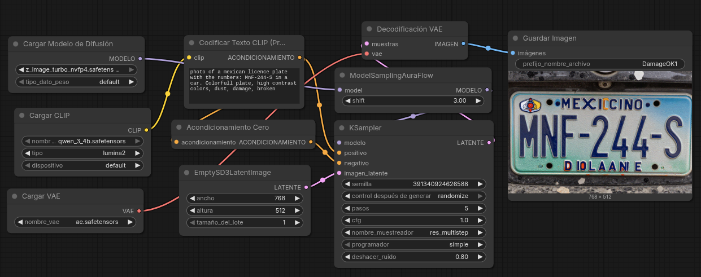
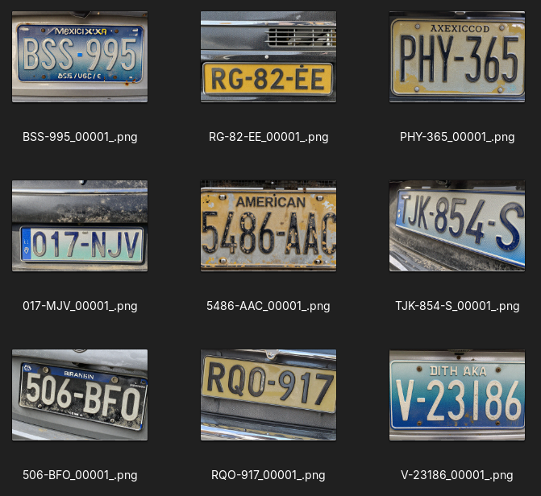

# 🚗 ComfyPlate

**ComfyPlate** is an automated workflow designed for the creation and validation of a high-quality synthetic license plate dataset.

This project solves the OCR data collection problem using a two-stage pipeline:
1. **Image Generation** via ComfyUI using a Z-Image diffusion model.
2. **Automated Visual Audit** using a local vision LLM (via LM Studio or Ollama) to ensure the text generated in the image perfectly matches the dataset label.





## 💻 Hardware & Model Requirements

To run this pipeline locally, your system must meet the following hardware requirements and have the specific weights installed in your ComfyUI environment.

* **VRAM Required:** 8 GB (Peak during ComfyUI generation).
* **UNet Model (Z-Image):** `z_image_turbo_nvfp4.safetensors` (Size: 4.5 GB)
* **CLIP Model:** `qwen_3_4b.safetensors` (Size: 8 GB)
* **VAE Model:** `ae.safetensors`

### Software Dependencies
* Python 3.x
* `requests` library
* **ComfyUI** running locally at `http://127.0.0.1:8188`
* **Vision LLM Server:** LM Studio (OpenAI-compatible API) or Ollama (`/api/chat`). The `qwen/qwen3-vl-4b` model is recommended if your hardware permits.

---

## 📁 Project Structure

* `generator.py`: Main script that builds prompts and queues jobs to the ComfyUI API.
* `PlateGenerator.json`: Base ComfyUI workflow (Diffusion nodes, CLIP Text Encode, KSampler, etc.).
* `LLM_reviewer_LMStudio.ipynb`: Notebook for image validation using an OpenAI-compatible endpoint (LM Studio).
* `LLM_reviewer_Ollama.ipynb`: Alternative notebook for validation using Ollama's native endpoint.
* `Output/`: Temporary directory for raw images generated by ComfyUI.
* `Dataset/PlatesReviewed/correctas/`: Final destination for validated and accepted images.
* `Dataset/PlatesReviewed/incorrectas/`: Destination for images rejected by the LLM.

---

## 🚀 Phase 1: Generation (ComfyUI + Z-Image)

The `generator.py` script orchestrates the image creation. It dynamically builds the license plate prompts, adjusts the workflow parameters (`PlateGenerator.json`), and sends POST requests to the ComfyUI endpoint.

The key to the system is that **the generated filename includes the expected license plate text** (e.g., `PTC-836_00001_.png`), which serves as the "Ground Truth" for the review phase.

### Customizable Parameters (Via Script)

You can adjust the variety of the dataset by modifying the following variables:

* **Text Patterns:** Configurable in `crear_prompt_robusto` (e.g., `CCC-NNN-C`, `NNN-CCC`).
* **Styles & Origin:** Mexican, American, Spanish, German, Japanese, etc.
* **Backgrounds:** Dark, classic white, vintage yellow, blue gradient, etc.
* **Wear & Tear:** Ranging from "brand new" to "severe wear/dirty".
* **Resolution:** Randomly set between `512x512` and `768x512`.
* **Sampling Steps:** Randomly set between 1 and 5 (optimized for the Turbo model).
* **Seed:** Randomized for each generated image.
* **KSampler Config:** Defaults to `sampler_name=res_multistep`, `scheduler=simple`, `cfg=1.0`, `denoise=0.80`.

---

## 🧠 Phase 2: Automated Review (Vision LLM)

Not all images generated by diffusion models have perfect text. The review notebooks act as an automated quality filter.

The system reads the images from the `Output/` folder, extracts the expected plate from the filename, and asks the local LLM to "read" the actual image. The LLM returns a structured JSON with its analysis.

### Routing Logic

Images are automatically classified and moved based on the following rules:

* **To `correctas/`:** The plate detected by the LLM *exactly* matches the expected plate from the filename.
* **To `correctas/` (Renamed):** There is a one-character difference (a minor generation or reading error) but the image is visually usable. The file is renamed to match the text that actually appears in the image.
* **To `incorrectas/`:** The image is marked as unusable, contains duplicate plates in the same image, or has unrecoverable text errors.

---

## 🛠️ Quick Start Guide

1.  **Start ComfyUI:** Ensure the server is running at `127.0.0.1:8188` and that the required `.safetensors` models are in their respective folders.
2.  **Generate a Batch:** Run the Python script to start queuing images.
    ```bash
    python generator.py
    ```
3.  **Wait for Generation:** Let ComfyUI process the queue and save the results to the `Output/` folder.
4.  **Start LLM Server:** Open LM Studio or start Ollama with your preferred vision model.
5.  **Run the Review:** Open and run all cells in your preferred notebook (`LLM_reviewer.ipynb` or `LLM_reviewer_Ollama.ipynb`).
6.  **Verify Results:** Check the statistics printed at the end of the notebook and explore the `correctas/` and `incorrectas/` folders.
